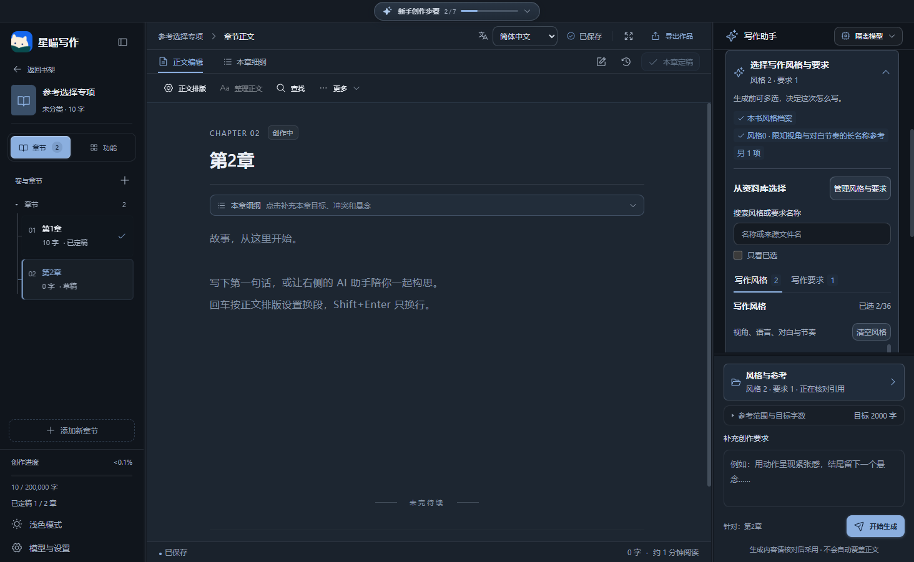
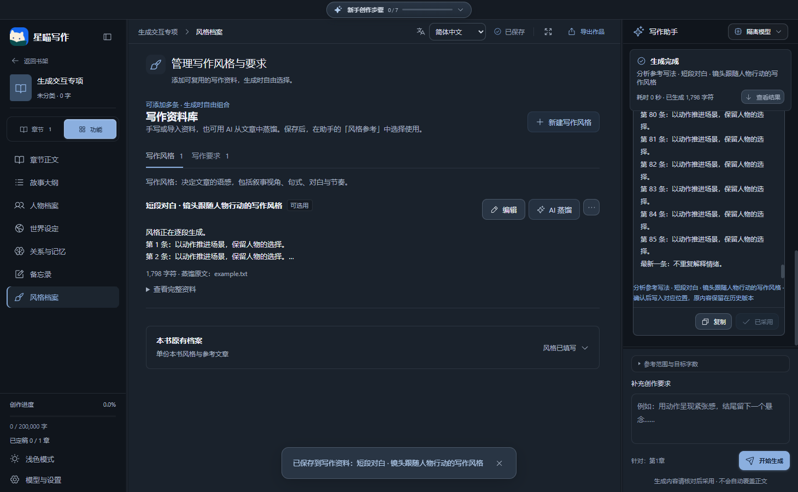

# 星喵写作 · 完整版下载

**会员免费，无需付费开通。** 完整版中的会员与普通用户区分，仅用于方便管理广场提示词库、区分相关权限，不是收费套餐。第三方 AI 模型和生图 API 可能由服务商计费，与免费会员无关。开源核心版不包含账号、会员和广场模块。

本地优先的 Windows AI 小说工作台。本仓库用于分发完整软件；[开源核心源码](https://github.com/z55902383-debug/xingmiao-writer-core)单独维护。

## 下载

- [完整版 v0.6.9 Windows x64 安装包](https://github.com/z55902383-debug/xingmiao-writer-releases/releases/download/v0.6.9/XingmiaoWriter-0.6.9-x64-Setup.exe)
- [开源核心版安装包](https://github.com/z55902383-debug/xingmiao-writer-core/releases/download/v0.6.9/XingmiaoWriter-Core-0.6.9-x64-Setup.exe)
- [完整版更新与附件](https://github.com/z55902383-debug/xingmiao-writer-releases/releases/tag/v0.6.9)

## v0.6.9 风格选择与引用清单

- 生成按钮上方常驻风格与参考入口，显示选中数量并直达风格选择和当前引用清单
- 多条风格和要求按页签、已选/可选层级展示，支持搜索名称与来源、只看已选、分别清空；长列表独立滚动
- 引用清单按实际请求资料分组，定向蒸馏不误报其他作品资料；候选稿保留当时的引用快照
- 资料库增加搜索与状态筛选，目标字数直接显示，窄窗口管理入口、较小设置区及空/失败状态更清楚

[使用说明](docs/风格选择与参考资料说明.md) · [本次检查](docs/检查记录-v0.6.9.md)

## v0.6.8 生成反馈与风格页面优化

- 写作助手顶部常驻真实生成状态：准备资料、等待响应、接收内容、分析变化，显示耗时与已生成字符数
- 生成中增加柔和流光边框、流动细线与旋转图标；支持减少动态效果，完成、停止与失败后结束动画
- 流式内容跟随最新段落，向上阅读自动暂停，可一键恢复；中央生成入口直接定位本次候选，及时刷新模型暂停前的最后一段
- 写作资料库按风格与要求说明用途，标示已选用、可选用或待填写；导出删除收入更多菜单，本书原有档案独立收起

[界面操作说明](docs/生成进度与风格页面说明.md) · [本次检查](docs/检查记录-v0.6.8.md)

## v0.6.7 风格与要求资料库

- 风格档案新增多条写作风格与写作要求，可新建、编辑、删除恢复、导入和导出
- 支持为风格和要求分别导入原文并用 AI 蒸馏，预览后采用到指定条目，保留编辑历史
- 本次参考资料新增风格参考，可分别选择多条风格和要求，仅发送选中内容并保留本次使用记录
- 兼容原本书风格，新增资料随作品 JSON 备份恢复，阻止陈旧结果覆盖新资料

[操作说明](docs/风格与写作要求使用说明.md) · [本次检查](docs/检查记录-v0.6.7.md)

## v0.6.6 广场删除修复

修复已添加到本机的资源无法点击删除的问题。服务器继续核验上传者，删除共享原件后保留本机副本。[更新与验证](docs/广场删除修复-v0.6.6.md)

## 功能

书架、章节与分卷、大纲、人物与世界、关系图谱、时间线、资料画布、AI 写作与候选审核、来源记忆、本地 Skill、历史版本、备份恢复、中英双语与深浅主题。

完整版另含创意工具箱、封面生成、飞书账号、会员与共享广场服务及安装更新。离线编辑无需登录；AI 和生图需要自己的模型配置，可能产生费用。账号与广场依赖维护者的在线服务。

[功能说明](docs/features.md) · [检查报告与已知限制](docs/检查记录-v0.6.7.md)

## 分步创作流程

想法 → 全文大纲 → 分卷 → 卷大纲/细纲 → 章节大纲/细纲 → 正文 → 完成。逐步生成并采用，同步卷名、章名与内容，保留已有正文并提示下一步。长规划改为摘要预览和完整阅读。

[操作与采用规则](docs/分步创作流程与采用说明.md) · [本次检查](docs/检查记录-v0.6.5.md)

## v0.6.5 人工码字与界面更新

- 人工码字板：临时稿、章节独立草稿、存入作品、冲突恢复、TXT 导出与稿件历史。
- 专注计时、写作目标、查找替换、撤销与字体字号行距；正文排版与 AI 工作台共用规则。
- 灵感助手、作品备忘录、整篇/片段引用；生成讨论与正式正文分开。
- 分组工具栏、可收起侧栏与窄屏适配；分卷父层级、本卷章节与完成状态更清晰。

[人工码字操作说明](docs/人工码字板使用说明.md)

## 更新安装目录

更新安装会打开安装向导，允许选择安装目录；新版客户端默认带入当前程序所在目录。v0.6.5 安装包收到旧客户端的静默更新请求时，也会显示向导，请在安装前确认目录位于你希望的磁盘。安装目录与书库目录独立，更换安装位置不会自动迁移作品。

## 安装与数据

下载 Setup.exe 安装。已带更新功能的完整版可在“模型与设置 → 版本与更新”检查、下载和安装。定期通过 JSON 导出作品备份。

完整版和开源版使用独立书库；跨版本迁移使用 JSON 备份/副本恢复，不互换运行中的数据库。安装包不包含个人作品或模型密钥。Windows x64 为本次交付平台，安装包未配置代码签名证书。

## 版本与许可

开源核心版包含主要本地写作工作台，采用 MIT。创意工具箱、生图、账号、会员、广场和内置更新属于完整版附加模块；核心源码 MIT 不表示所有完整版附加模块同样采用 MIT。

安装包附带第三方运行时许可。AI 结果和故事连续性需要作者审核；真实模型、账号和网络环境的限制见检查报告。

## 反馈

请通过 Issues 附上版本、复现步骤和错误提示，不要上传 API 密钥、账号会话或私人小说。开发与贡献请访问[开源核心仓库](https://github.com/z55902383-debug/xingmiao-writer-core)。
